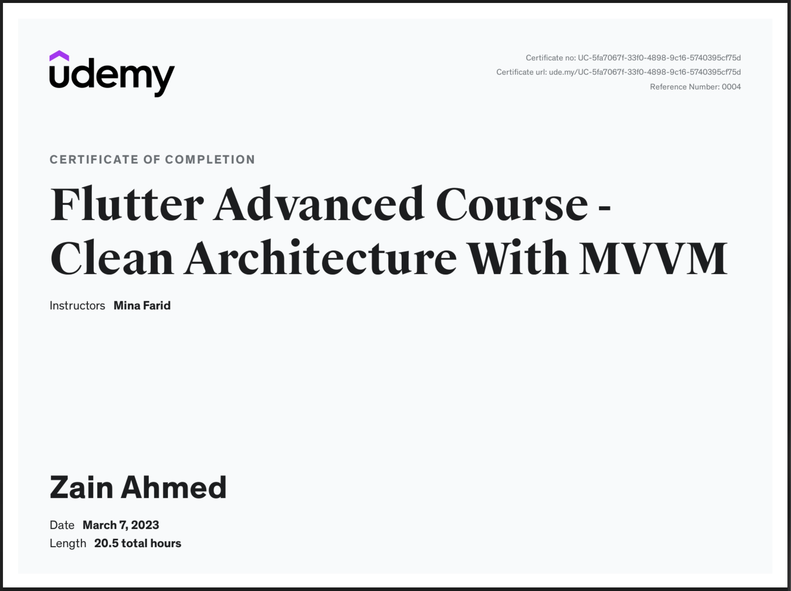

# Flutter-Advanced-Course_Clean-Architecture-With-MVVM

## Getting Started

Using this dependencies to make this learn project
cupertino_icons:
flutter_svg:
analyzer:
dio:
retrofit:
retrofit_generator:
dartz:
data_connection_checker:
pretty_dio_logger:
shared_preferences:
device_info_plus:
freezed:
get_it:
lottie:
fl_country_code_picker:
image_picker:
rxdart:
carousel_slider:
easy_localization:
flutter_phoenix:
json_serializable:
build_runner:

To run project:  flutter run --no-sound-null-safety
Login ID: abc
Password: 123456

- [Flutter Advanced Course - Clean Architecture With MVVM: View here](https://www.udemy.com/course/flutter-advanced-course-clean-architecture-with-mvvm/)
- [Udemy certificate: View here](https://www.udemy.com/certificate/UC-5fa7067f-33f0-4898-9c16-5740395cf75d/)
- 
- 

